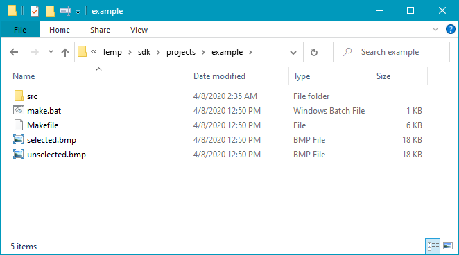
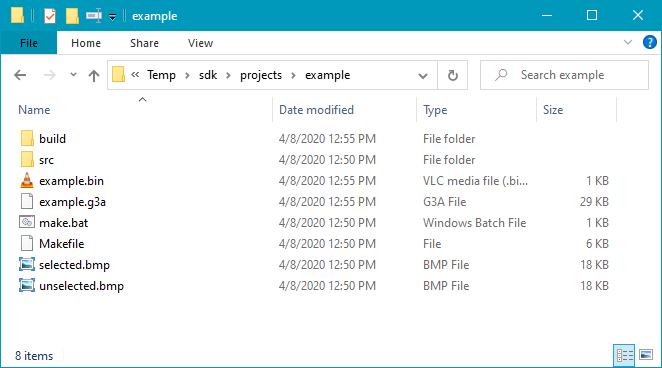

# Getting started on Windows

This document will walk you through the process of setting up the Prizm SDK and
building your first add-in on Windows. If you don't use Windows, refer to the
information in the [top-level README](../README.md).

## Download and unpack the SDK

Download an SDK package from the [releases
page](https://github.com/Jonimoose/libfxcg/releases/) and unpack it somewhere.
Pictured below, I extracted the v0.5 release into G:\Temp\:

## Look at the example project

Navigate to `projects`, then `example`. This directory contains the example
project to get you started with and looks like this:

The `selected.bmp` and `unselected.bmp` images are built into the compiled
add-in and are the icons shown in the calculator's menus for the add-in when it
is selected with the cursor and unselected, respectively.

`Makefile` is a plain-text file that includes instructions that tell the system
how to compile the add-in. You can edit this with any text editor of your
choice, but in most cases don't need to (and probably shouldn't unless you know
what you're doing). If you're just getting started, it's safe to ignore this
file. Similarly, `make.bat` allows you to run a single command and compile the
add-in and you shouldn't need to touch it.

In the `src` directory is the add-in source code, which contains one file:
`example.c`. All of the C files in this directory will be compiled into your
application so you can add more files to your own project, but just the given
file is sufficient to build the example project.

## Compile the example project

To compile the example project, simply run `make.bat` in the project directory
using your favorite shell. If you don't know what this means, try the following
(on recent Windows; older versions don't have the pictured shortcuts, sadly).

Open a PowerShell in the example directory, from the Windows Explorer File menu:

Then type `.\make` into powershell, which should run the compilation process and
may emit additional messages:

If successful, this should build a `.bin` and `.g3a` file in the project
directory:

The `example.g3a` file is ready to send to your calculator for running now.

## Making changes and rebuilding

Every time you run `make` as above, the system will rebuild the g3a file if
there have been any changes to the sources. It's possible that won't always work
as you expect, so you can also run `.\make clean` to erase the output files from
the compilation process and ensure you're building a totally fresh version.

## Making your own project

Now that you know how to build an add-in, it's time to write your own program.
Make a copy of the `example` project and call it something else (probably a name
related to what your project is), then you can write your own code however you
like.
